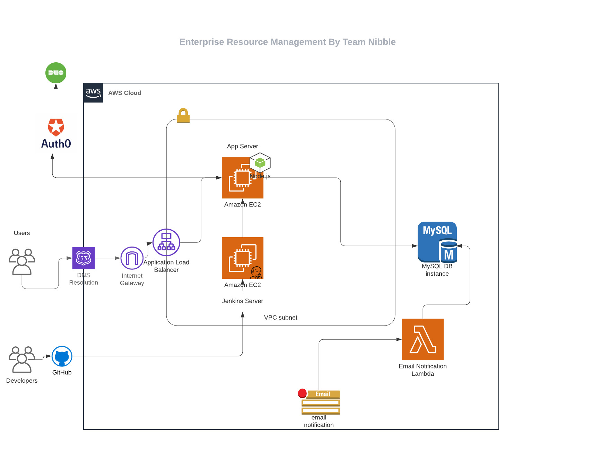

# CMPE-272 - Enterprise SOFTWARE PLATFORMS
## Project: Enterprise Resource Management

# CMPE-281 - CLOUD TECHNOLOGIES 


PROFESSOR - Andrew Bond


SUBMITTED BY : 
1. Varun Alla (Team leader) 
2. Aakanksha Gupta 
3. Abhishek Yadav
4. Hasini Reddy 


SAN JOSE STATE UNIVERSITY 

COMPUTER ENGINEERING DEPARTMENT

https://web.nibbleproject.xyz/


## ARCHITECTURE:


##TECHNOLOGIES/PLATFORMS:
------
1. FRONTEND: ANGULAR, ANGULAR MATERIAL

2. BACKEND: Node.js

3. AWS SERVICES: AWS EC2, AWS LAMBDA, AWS RDS 

4.SOCIAL INTEGRATIONS: TWITTER

5. SSO: Auth0

6. MFA: Duo

7. CI/CD: Jenkins. 

8. Dev Environement: VISUAL STUDIO CODE 

## ROLES:
----
1. Admin
2. Employee
3. Manager 
4. HR

## BASIC SETUP STEPS: 
### UI SETUP STEPS: 
-----

```
cd ui/nibbleproject
npm install 
ng build
```
###Backend SETUP STEPS: 
```
cd backend/core
npm ci 
node .
```
Environment File Content
```
secret=
clientsecret=
clientId=
issuerBaseURL=
SERVER_PORT=
DB_USER=
DB_PASS=
DB_NAME=
DB_HOST=
apiKey=
apiSecret=
baseURL=
manager_role_id=
employee_role_id=
hr_role_id=
```


